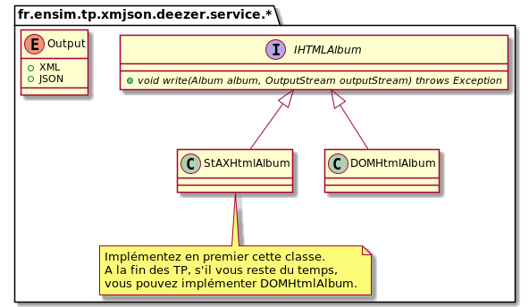

# Travaux Pratiques Technologies XML/JSON/JWT

## Objectifs
* Lire des documents XML avec les API SAX, StaX et DOM
* Ecrire des documents XML avec les API DOM et StaX API
* Lire des documents JSON

## Présentation du projet
<a href="https://developers.deezer.com/api">

</a>

L'API REST Deezer offre des services pour découvrir de la musique.
Elle offre notamment les services suivants :
* Rechercher les albums d'un auteur.
* Rechercher les chansons d'un album.

Pour plus d'information sur l'API Deezer, vous pouvez consulter le lien suivant [https://developers.deezer.com/api](https://developers.deezer.com/api)

Les classes Album, Artist et Track sont décrites dans le package fr.ensim.tp.xmjson.deezer.data


## Configuration
### Maven et proxy
Créer le fichier settings.xml dans votre répertoire $home/.m2
```
<?xml version="1.0" encoding="UTF-8"?>
<settings xmlns="http://maven.apache.org/SETTINGS/1.0.0"
xmlns:xsi="http://www.w3.org/2001/XMLSchema-instance"
xsi:schemaLocation="http://maven.apache.org/SETTINGS/1.0.0
http://maven.apache.org/xsd/settings-1.0.0.xsd">
<proxies>
<proxy>
<active>true</active>
<protocol>http</protocol>
<host>proxy.univ-lemans.fr</host>
<port>3128</port>
<nonProxyHosts>*.univ-lemans.fr</nonProxyHosts>
</proxy>
</proxies>
</settings>
```
### IntelliJ IDEA et proxy
* Proxy
```
File-->Settings-->Proxy
```


### Import du projet dans IntelliJ IDEA
```
1. File --> New --> Project from existing sources
2. Sélectionnez le répertoire du projet à importer
3. Choisir maven
```

```
File-->Project Structure...
```


# Projet

## Partie 1 : XML
### 1.1 Rechercher les albums d'un auteur avec l'API SAX
Exemple : rechercher les albums de Diiv en XML

* API REST [http://api.deezer.com/2.0/search/album?q=mannequin%20pussy&output=xml](http://api.deezer.com/2.0/search/album?q=diiv&output=xml)

* UML  
  

* Implémentation à compléter :
  * Source [src/main/java/fr/ensim/tp/xmljson/deezer/service/sax/SAXSearchAlbumsHandler.java](src/main/java/fr/ensim/tp/xmjson/deezer/service/sax/SAXSearchAlbumsHandler.java)
* Test unitaire à réaliser
  * Jeu de test [src/test/resources/data/list-album-diiv.xml](src/test/resources/data/list-album-diiv.xml)

### 1.2 Rechercher les titres d'un album avec l'API DOM
Exemple : rechercher l'album dont l'id est 6332024

* API REST [http://api.deezer.com/2.0/album/6332024?output=xml](http://api.deezer.com/2.0/album/6332024?output=xml)

* UML  
  

* Implémentation à compléter :
  * Source [src/main/java/fr/ensim/tp/xmljson/deezer/service/dom/DOMSearchTrack.java](src/main/java/fr/ensim/tp/xmjson/deezer/service/dom/DOMSearchTrack.java)
* Test unitaire à réaliser
  * Jeu de test [src/test/resources/data/album-6332024.xml](src/test/resources/data/album-6332024.xml)

### 1.3 Ecrire une page HTML5 affichant les chansons de l'album en StaX

* Exemple de page HTML5 :  
  

* UML  
  

* Implémentation à compléter :
  * Source [src/main/java/fr/ensim/tp/xmljson/deezer/service/stax/StAXHtmlAlbum.java](src/main/java/fr/ensim/tp/xmjson/deezer/service/stax/StAXHtmlAlbum.java)

### 1.4 Exécutez la class [src/main/java/fr/ensim/xml/deezer/Main.java](src/main/java/fr/ensim/tp/xmjson/deezer/Main.java)
La classe Main effectue les traitements suivants :
* Appel de l'API SAX pour rechercher les albums de Diiv
* Ecriture en DOM du 1er album
* Ecriture de la page HTML en StAX
* Ouverture du navigateur par défaut avec la page HTML.

## Partie 2 : JSON
### 2.1 Rechercher les albums d'un auteur en JSON
* API REST [http://api.deezer.com/2.0/search/album?q=diiv&output=json](http://api.deezer.com/2.0/search/album?q=diiv&output=json)
* API JSON [https://javadoc.io/doc/org.json/json/latest/index.html](https://javadoc.io/doc/org.json/json/latest/index.html)

* Implémentation à compléter :
  * Source [src/main/java/fr/ensim/tp/xmljson/deezer/service/json/JSONSearchAlbums.java](src/main/java/fr/ensim/tp/xmjson/deezer/service/json/JSONSearchAlbums.java)
  * Test unitaire à réaliser. Jeu de test [src/test/resources/data/list-album-diiv.xml](src/test/resources/data/list-album-diiv.xml)

## Partie 3 : JWT
### Bonus
Creer un jeton JWT suivant
* Header
```
{ 
"alg": "HS256",
"typ": "JWT"
}
```
* Payload
```
{
  "sub": "1234567890",
  "name": "John Doe",
  "iat": 1516239022
}
```
* Signature  HMAC-SHA256

